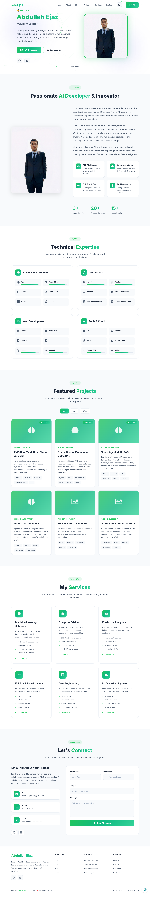

# Abdullah Ejaz's Portfolio

Welcome to my developer portfolio!  
Showcasing my best projects in AI, automation, full-stack, and more.

- **Live Portfolio:** [https://portfolio-phi-two-36.vercel.app/](https://portfolio-phi-two-36.vercel.app/)
- **GitHub Repo:** [https://github.com/AbdullahEjaz512/portfolio](https://github.com/AbdullahEjaz512/portfolio)

---
## Screenshots



## 🚀 Featured Projects

### 1. [Seg-Mind](https://github.com/AbdullahEjaz512/Seg-Mind)  
AI-powered image segmentation platform.  
**Demo:** [Live Site](http://fyp-1-st56.vercel.app/)

### 2. [All-in-One Job Agent](https://github.com/AbdullahEjaz512/resume-builder-job-agent-extension)  
Agentic AI system for resume/job automation.  
**Demo:** [Live Site](https://resume-builder-job-agent-extension.vercel.app/)

### 3. [E-Commerce Dashboard](https://github.com/AbdullahEjaz512/E-Dashboard)  
Modern dashboard for e-commerce analytics.  
**Demo:** [Live Site](https://e-dashboard-6c6i.vercel.app/)

### 4. [Neuro-Stream Multimodal Video RAG](https://github.com/AbdullahEjaz512/Neuro-Stream-Multimodal-Video-RAG)  
Multimodal retrieval-augmented generation for video understanding.

### 5. [Voice-Agent-Multi-RAG](https://github.com/AbdullahEjaz512/Voice-Agent-Multi-Rag)  
Conversational AI agent with multi-source retrieval.

### 6. [Medi-Cora](https://github.com/AbdullahEjaz512/Medi-Cora)  
AI-powered medical assistant.

### 7. [Aztrosys Website](https://github.com/AbdullahEjaz512/aztrosys-website)  
Full-stack business website.

---

## 🛠️ Tech Stack

- **Frontend:** React.js, JavaScript, HTML, CSS
- **Backend:** Node.js, Python (project-specific)
- **AI/ML:** LLMs, Ollama, custom NLP, automation
- **Deployment:** Vercel

---

## 📬 Contact

Want to collaborate or have a question?  
Use the contact form on the [portfolio site](https://portfolio-phi-two-36.vercel.app/) or email: **abdullahejaz512@gmail.com**

---

## 📝 How to Run Locally

```bash
git clone https://github.com/AbdullahEjaz512/portfolio.git
cd portfolio
npm install
npm start
```

---

> **Note:**  
Some projects have live demos; others link to their GitHub repos only.

---

© 2024 Abdullah Ejaz